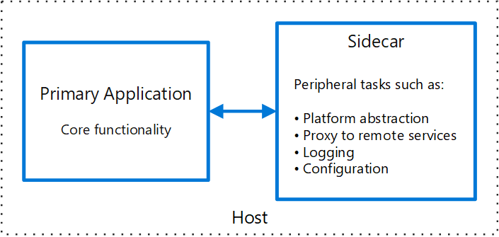
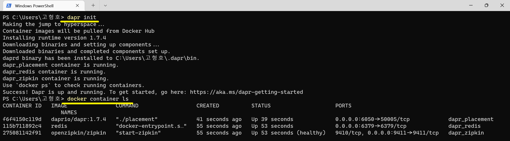
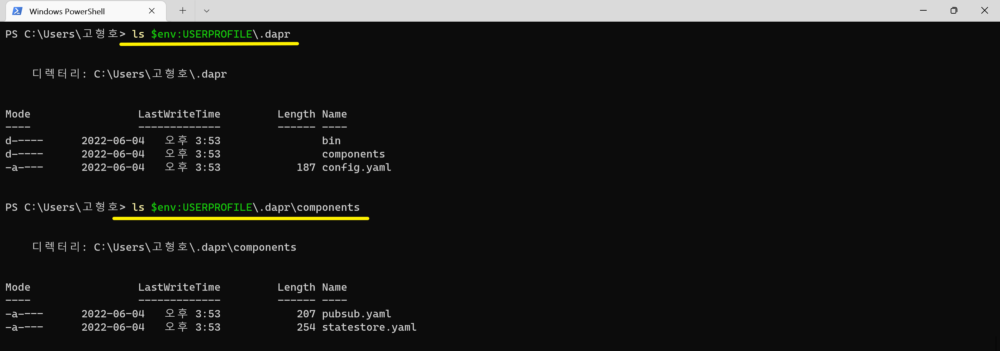
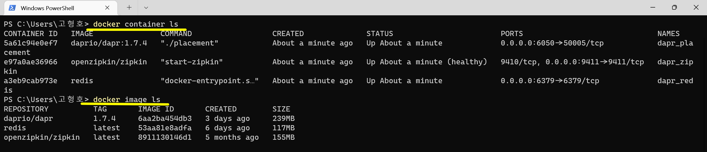
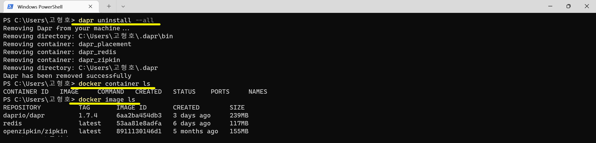

# 1장. Getting Started with Dapr

## 목차
- 배경
  - 목표
  - Dapr란
- Self-Hosted Windows Dapr 설치
  - Windows Dapr 사전 준비
  - Self-Hosted Windows Dapr CLI 설치
  - Self-Hosted Windows Dapr Runtime 설치
  - Self-Hosted Windows Dapr Runtime 제거
  - Self-Hosted Windows Dapr CLI 제거
- 참고 자료

## 배경
### 목표
- Distributed Application 개발을 위한 Dapr을 이해한다.
  - 아키텍처 :  Sidecar Architecture
  - 구성 : Runtime, CLI
- Self-Hosted Windows Dapr을 설치한다.

### Dapr란
- Dapr(`D`istributed `Ap`plication `R`untime)는 Distributed Application 개발을 위해 Sidecar Architecture으로 Runtime을 제공한다.  
  Runtime은 컨테이너 기반으로 Self-Hosted와 Kubernetes 2개 환경을 제공한다.  
  Runtime을 관리하기 위한 CLI(Command-line interface)을 제공한다.
- [Sidecar Architecture](https://docs.microsoft.com/ko-kr/azure/architecture/patterns/sidecar)  
  격리 및 캡슐화를 제공하는 **별도의 프로세스 또는 컨테이너에** 애플리케이션 구성 요소를 배포합니다.  
  


## Self-Hosted Windows Dapr 설치
### Self-Hosted Windows Dapr 설치 준비
- Docker Desktop


### Self-Hosted Windows Dapr CLI 설치
#### CLI 설치
```shell
# - 관리자일 때
powershell -Command "iwr -useb https://raw.githubusercontent.com/dapr/cli/master/install/install.ps1 | iex"
# - 설치 내용
#   - C:\dapr 폴더를 생성한다.
#   - dapr.exe 파일을 다운로드 받는다.
#   - 사용자 환경 변수 Path에 "C:\dapr" 경로를 추가한다.

# - 일반 사용자일 때
$script=iwr -useb https://raw.githubusercontent.com/dapr/cli/master/install/install.ps1; $block=[ScriptBlock]::Create($script); invoke-command -ScriptBlock $block -ArgumentList "", "$HOME/dapr"
```

#### CLI 설치 검증
```shell
# 새 Prompt 창 열기
dapr -v
dapr
```


### Self-Hosted Windows Dapr Runtime 설치
#### Runtime 설치
```shell
dapr init
# - 최신 Runtime 버전 설치
# dapr init
# - 특정 Runtime 버전 설치
# dapr init --runtime-version 1.0.0
# - 특정 경로에 Runtime 설치
# dapr init --from-dir .
# - 특정 도커 네트워크로 Runtime 설치
# docker network create dapr-network
# dapr init --network dapr-network

# $env:USERPROFILE\.dapr\
#   bin\
#     daprd.exe
#     dashboard.exe
#     ...
#   components\
#     pubsub.yaml
#     statestore.yaml
#
```



#### Runtime 설치 검증
```shell
# 버전 확인
dapr -v

# 환경 파일 확인
ls $env:USERPROFILE\.dapr\components

# 컨테이너 확인
docker container ls
docker image ls
```




### Self-Hosted Windows Dapr Runtime 제거
```shell
# --all : Remove .dapr directory, Redis, Placement and Zipkin containers on local machine, and CRDs on a Kubernetes cluster
#   - $env:USERPROFILE\.dapr 폴더 삭제됨
#   - 도커 컨테이너 중지됨
#   - 도커 이미지는 삭제 안됨
dapr uninstall --all
# - 기본 삭제 : Uninstall from self-hosted mode
# dapr uninstall
# - .dapr 폴더 삭제 : Uninstall from self-hosted mode and remove .dapr directory, Redis, Placement and Zipkin containers
# dapr uninstall --all
# dapr uninstall --network dapr-network
```



## 참고 자료
- [Install the Dapr CLI](https://docs.dapr.io/getting-started/install-dapr-cli/)
- [Initialize Dapr in your local environment](https://docs.dapr.io/getting-started/install-dapr-selfhost/)
- [uninstall CLI command reference](https://docs.dapr.io/reference/cli/dapr-uninstall/)
- Powershell
  ```shell
  Set-ExecutionPolicy RemoteSigned -scope CurrentUser
  ```
