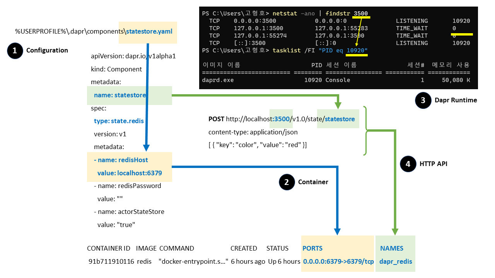
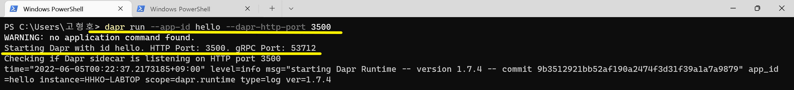
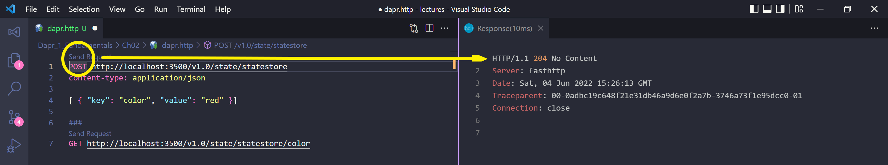
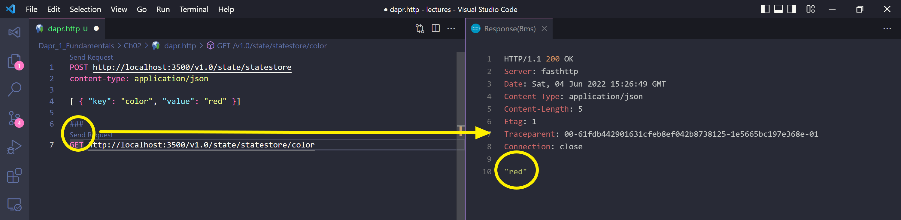
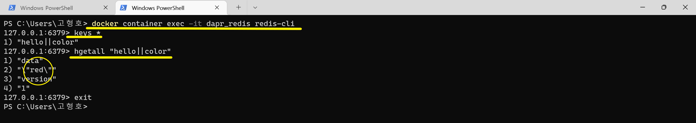
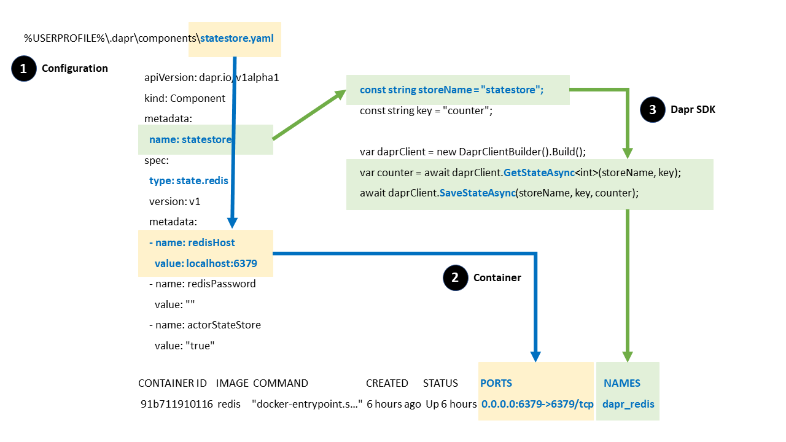

# 2장. Implementing State Management

## 목차
- 목표
- Sidecar CLI 예제
  - Sidecar만 실행하기 : daprd 프로세스 실행
  - Sidecar와 통신하기 : 영속성 데이터 생성 및 조회
  - Sidecar의 데이터 확인하기 : Redis 컨테이너 데이터 조회
  - Sidecar의 네트워크 포트 확인하기 : daprd 프로세스의 네트워크 포트
- dapr run 플래그
- dapr components 구성
- DaprCounter Console 예제
- ASP.NET Core State 예제


## 목표
- Dapr의 Sidecar Architecture을 이해한다.
  - Sidecar만 실행하기 : `dapr run`
  - Sidecar HTTP API 통신하기 : `--dapr-http-port`
- Dapr의 state component 구성을 이해한다.
  - 전역 Sidecar component 정보 : `%USERPROFILE%\.dapr\components\`


## Sidecar CLI 예제


### Sidecar만 실행하기 : daprd 프로세스 실행
```shell
dapr run --app-id hello --dapr-http-port 3500
```

- application id : `hello`
- sidecar http port : `3500`

### Sidecar와 통신하기 : 영속성 데이터 생성 및 조회
```shell
# 데이터 생성
POST http://localhost:3500/v1.0/state/statestore
content-type: application/json

[ { "key": "color", "value": "red" }]

###

# 데이터 조회
GET http://localhost:3500/v1.0/state/statestore/color
```



### Sidecar의 데이터 확인하기 : Redis 컨테이너 데이터 조회하기
```shell
# Redis 컨테이너 접속
docker container exec -it dapr_redis redis-cli

# Redis 키 목록 확인
keys *

# Redis 값 확인
# hello : --app-id hello
# color : "key": "color"
hgetall hello||color

# Redis 컨테이너 나오기
exit
```


### Sidecar의 네트워크 포트 확인하기 : daprd 프로세스의 네트워크 포트
```shell
# PowerShell
# 3500 포트 찾기
netstat -ano | findstr 3500
# 17088 PID 프로세스 이름 찾기
tasklist /FI "PID eq 17088"

# netstat 옵션
# -a : 모든 연결 및 수신 대기 포트를 표시합니다.
# -n : 주소 및 포트 번호를 숫자 형식으로 표시합니다.
# -o : 각 연결의 소유자 프로세스 ID를 표시합니다.

# tasklist 옵션
# /FI 필터 : 필터에서 지정한 조건과 일치하는 작업 집합을 표시합니다.
```

## dapr run 플래그
```shell
# Sidecar만 실행하기
dapr run --app-id myapp --dapr-http-port 3500

# .NET HTTP API 프로그램 실행
dapr run --app-id myapp --app-port 5000 -- dotnet run

# .NET gRPC 프로그램 실행
dapr run --app-id myapp --app-port 3000 --app-protocol grpc -- dotnet run

# dapr run 플래그
  -a, --app-id string       : The id for your application, used for service discovery
  -p, --app-port int        : The port your application is listening on (default -1)
  -P, --app-protocol string : The protocol (gRPC or HTTP) Dapr uses to talk to the application (default "http")
  -G, --dapr-grpc-port int  : The gRPC port for Dapr to listen on (default -1)
  -H, --dapr-http-port int  : The HTTP port for Dapr to listen on (default -1), `DAPR_HTTP_PORT`
```

## dapr components 구성
- components 구성 정보 : 
  - dapr Runtime(sidecar)는 기본적으로 `%USERPROFILE%\.dapr\components\` 폴더에 정의된 components 정보를 사용한다.
  - state component 정보는 `%USERPROFILE%\.dapr\components\statestore.yaml`에 Redis을 기본 값으로 설정되어 있다.

### statestore.yaml 파일
```yml
apiVersion: dapr.io/v1alpha1
kind: Component
metadata:
  name: statestore
spec:
  type: state.redis
  version: v1
  metadata:
  - name: redisHost
    value: localhost:6379
  - name: redisPassword
    value: ""
  - name: actorStateStore
    value: "true"
```
- 이름 : `name: statestore`, 고유 값이다.
- 타입 : `type: state.redis`
- 호스트 : `6379/tcp` 포트
  ```yml
  - name: redisHost
    value: localhost:6379
  ```
  ```shell
  docker container ls
  CONTAINER ID  IMAGE  COMMAND                 CREATED      STATUS      PORTS                   NAMES
  91b711910116  redis  "docker-entrypoint.s…"  6 hours ago  Up 6 hours  0.0.0.0:6379->6379/tcp  dapr_redis
  ```


## DaprCounter Console 예제

- [](https://docs.microsoft.com/en-us/dotnet/architecture/dapr-for-net-developers/getting-started)

### 솔루션 구성
```shell
# 솔루션 생성
dotnet new sln -o DaprCounter
cd .\DaprCounter\

# 프로젝트 생성
dotnet new console -o DaprCounter
dotnet add .\DaprCounter\ package Dapr.Client
dotnet sln add .\DaprCounter\
dotnet sln list

# 솔루션 빌드
dotnet build
```

```cs
using Dapr.Client;

const string storeName = "statestore";
const string key = "counter";

var daprClient = new DaprClientBuilder().Build();
var counter = await daprClient.GetStateAsync<int>(storeName, key);

while (true)
{
    Console.WriteLine($"Counter = {counter++}");

    await daprClient.SaveStateAsync(storeName, key, counter);
    await Task.Delay(1000);
}
```

```shell
# 실행
dapr run --app-id DaprCounter -- dotnet run --project .\DaprCounter\

Starting Dapr with id DaprCounter. HTTP Port: 57394. gRPC Port: 57395
Checking if Dapr sidecar is listening on HTTP port 57394
...
== APP == Counter = 0
== APP == Counter = 1
== APP == Counter = 2
== APP == Counter = 3
== APP == Counter = 4
== APP == Counter = 5
== APP == Counter = 6
== APP == Counter = 7
== APP == Counter = 8


# 실행 : 이전 값부터 Counter을 증가 시킨다
dapr run --app-id DaprCounter -- dotnet run --project .\DaprCounter\

Starting Dapr with id DaprCounter. HTTP Port: 57584. gRPC Port: 57585
Checking if Dapr sidecar is listening on HTTP port 57584
...
== APP == Counter = 9
== APP == Counter = 10
== APP == Counter = 11
== APP == Counter = 12
== APP == Counter = 13
== APP == Counter = 14
== APP == Counter = 15
```

```shell
# Redis 컨테이너 접속
docker container exec -it dapr_redis redis-cli

# Redis 키 목록 확인
keys *

# Redis 값 확인
# DaprCounter : --app-id DaprCounter
# counter : "key": "counter"
hgetall DaprCounter||counter
1) "data"
2) "16"
3) "version"
4) "16"
```

## 참고 자료
- [Detailed information on the Redis state store component](https://docs.dapr.io/reference/components-reference/supported-state-stores/setup-redis/)

## TODO
- [ ] https://hhko.github.io/learned/dapr/helloworld/state/state-csharp/
- [ ] https://github.com/markheath/globoticket-dapr
- [ ] PostgreSQL Insert 예제
