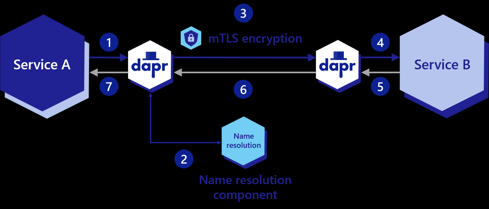
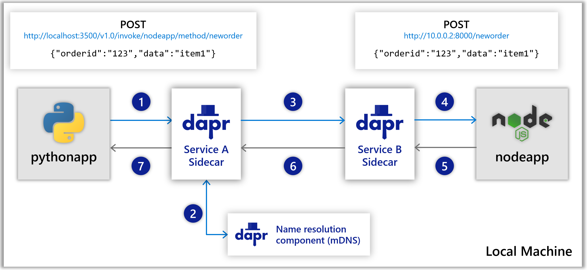

# 3장. Invoking Services

## 목차
- 목표
- ...

## 목표
- ...

### 주요 흐름



- [Service invocation overview](https://docs.dapr.io/developing-applications/building-blocks/service-invocation/service-invocation-overview/)
  - Kubernetes DNS
  - mDNS(Multicast DNS)

### Sidecar 주요 기능
- Service discovery : Where is the catalog service?
- Security(Encryption) : Defense in depth
- Observability(Tracing) : Open telemetry tracing
- Retries : Handle transient errors

### 성능
- [Service invocation performance](https://docs.dapr.io/operations/performance-and-scalability/perf-service-invocation/)
- [Actors activation performance](https://docs.dapr.io/operations/performance-and-scalability/perf-actors-activation/)

### URL
```shell
http://catalog/event/12345

# dapr case 1. Full URL
http://localhost:3500/v1.0/invoke/catalog/method/event/12345

# dapr case 2. HTTP Header
http://localhost:3500/event/12345
dapr-app-id: catalog
```