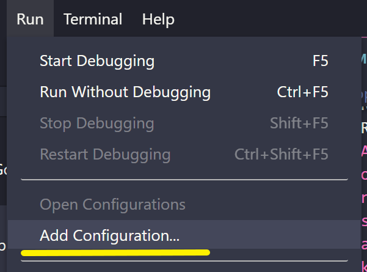
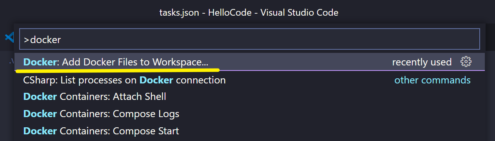

# Building and Running .NET Apps in Containers
## 목차
- Web API 솔루션 구성하기
- Windows Host에서 WebAPI을 위한 디버깅 설정하기
  - 디버깅을 위한 Configuration 구성하기 : `Add Configuration...`
  - WebAPI 웹 페이지 열기 : `launch.json`의 `launchBrowser`
- Linux Docker에서 WebAPI을 위한 디버깅 설정하기
  - Linux Docker 환경 구성하기 : `> Docker: Add Docker Files to Workspace...`
  - WebAPI 웹 페이지 열기 : `launch.json`의 `dockerServerReadyAction`

<br/>

## Windows Host
### 솔루션 생성하기
```shell
dotnet --version
dotnet new -l

# 솔루션 생성
dotnet new sln -o HelloCode

# 프로젝트 생성 및 추가
cd HelloCode
dotnet new webapi -o HelloCode.Api
dotnet sln add .\HelloCode.Api
dotnet sln list

# 솔루션 실행
dotnet run --project .\HelloCode.Api

# Browser로 API 문서 웹페이지 열기
https://localhost:7134/swagger
http://localhost:5279/swagger
```
- `-o` : 생성할 폴더와 파일을 같은 이름으로 생성한다.
- `-n` : 생성할 파일 이름을 지정한다.

### Windows Host 디버깅 기본 환경 구축하기
- `Menu` > `Run` > `Add Configuration...` : `.NET 5+ and .NET Core`
  
  ```
  .vscode
    launch.json
	tasks.json
  ```
  - `launch.json` : VSCode 디벙깅 설정
  - `tasks.json` : VSCode 실행 명령

### Windows Host 디버깅 때 API 웹 페이지 열기
```json
{
    // Use IntelliSense to learn about possible attributes.
    // Hover to view descriptions of existing attributes.
    // For more information, visit: https://go.microsoft.com/fwlink/?linkid=830387
    "version": "0.2.0",
    "configurations": [
        {
            "name": ".NET Core Launch (web)",
            "type": "coreclr",
            "request": "launch",
            "preLaunchTask": "build",
            "program": "${workspaceFolder}/HelloCode.Api/bin/Debug/net6.0/HelloCode.Api.dll",
            "args": [],
            "cwd": "${workspaceFolder}/HelloCode.Api",
            "stopAtEntry": false,
            "serverReadyAction": {
                "action": "openExternally",
                "pattern": "\\bNow listening on:\\s+(https?://\\S+)"
            },
            "launchBrowser": {
                "enabled": true,
                "args": "${auto-detect-url}/swagger",
                "windows": {
                    "command": "cmd.exe",
                    "args": "/C start ${auto-detect-url}/swagger"
                }
            },
            "env": {
                "ASPNETCORE_ENVIRONMENT": "Development"
            },
            "sourceFileMap": {
                "/Views": "${workspaceFolder}/Views"
            }
        },
        {
            "name": ".NET Core Attach",
            "type": "coreclr",
            "request": "attach"
        }
    ]
}
```
- 디버깅할 때 API 웹 페이지 열기를 위해 Windows 전용으로 `launchBrowser`을 설정한다.

## Linux Docker
### Linux Docker 디버깅 환경 구축하기
- `Ctrl+Shift+P` > `> Docker: Add Docker Files to Workspace...`
  
  - `.NET: ASP .NET Core` > `Linux` > `5120` > `No`
- `launch.json` 파일 : `Docker .NET Core Launch`이 자동 추가된다.
- `tasks.json` 파일 : `docker-build`와 `docker-run`이 자동 추가된다.
  - `Docker .NET Core Launch`가 `docker-run`을 호출하고, `docker-run`은 `docker-build`을 호출하는 관계다.

### Linux Docker 디버깅 때 API 웹 페이지 열기
```json
{
    // Use IntelliSense to learn about possible attributes.
    // Hover to view descriptions of existing attributes.
    // For more information, visit: https://go.microsoft.com/fwlink/?linkid=830387
    "version": "0.2.0",
    "configurations": [
        {
            "name": ".NET Core Launch (web)",
            "type": "coreclr",
            "request": "launch",
            "preLaunchTask": "build",
            "program": "${workspaceFolder}/HelloCode.Api/bin/Debug/net6.0/HelloCode.Api.dll",
            "args": [],
            "cwd": "${workspaceFolder}/HelloCode.Api",
            "stopAtEntry": false,
            "serverReadyAction": {
                "action": "openExternally",
                "pattern": "\\bNow listening on:\\s+(https?://\\S+)"
            },
            "launchBrowser": {
                "enabled": true,
                "args": "${auto-detect-url}/swagger",
                "windows": {
                    "command": "cmd.exe",
                    "args": "/C start ${auto-detect-url}/swagger"
                }
            },
            "env": {
                "ASPNETCORE_ENVIRONMENT": "Development"
            },
            "sourceFileMap": {
                "/Views": "${workspaceFolder}/Views"
            }
        },
        {
            "name": ".NET Core Attach",
            "type": "coreclr",
            "request": "attach"
        },
        {
            "name": "Docker .NET Core Launch",
            "type": "docker",
            "request": "launch",
            "preLaunchTask": "docker-run: debug",
            "netCore": {
                "appProject": "${workspaceFolder}/HelloCode.Api/HelloCode.Api.csproj"
            },
            "dockerServerReadyAction": {
                "uriFormat": "%s://localhost:%s/swagger"
            }
        }
    ]
}
```
- API 문서 웹페이지를 열기 위해 `dockerServerReadyAction`을 추가한다.

## TODO
- [ ] Docker 기반 프로세스의 로그가 출력되지 않는다 : 개선 방법?
- [ ] 기본으로 생성하기는 Dockerfile 이해하기